# awsCloudFormation

# 1. Overview

## 1.1 Introduction
This project leverages GitHub's automated deployment capabilities, utilizing AWS CloudFormation templates to build 
a service on the AWS Cloud platform with a general-purpose architecture. 
It includes key components such as frontend, backend, user authentication, and storage. 

The core objective of this project is to explore and practice the integration of automated deployment,
Infrastructure as Code (IaC), and AWS cloud services, providing a learning opportunity for best practices 
in cloud-native architecture.

Below are the target system architecture and network architecture diagrams to help you better understand the 
system's design and functionality.

Note: RDS is not implemented in this project; a containerized database is used instead.

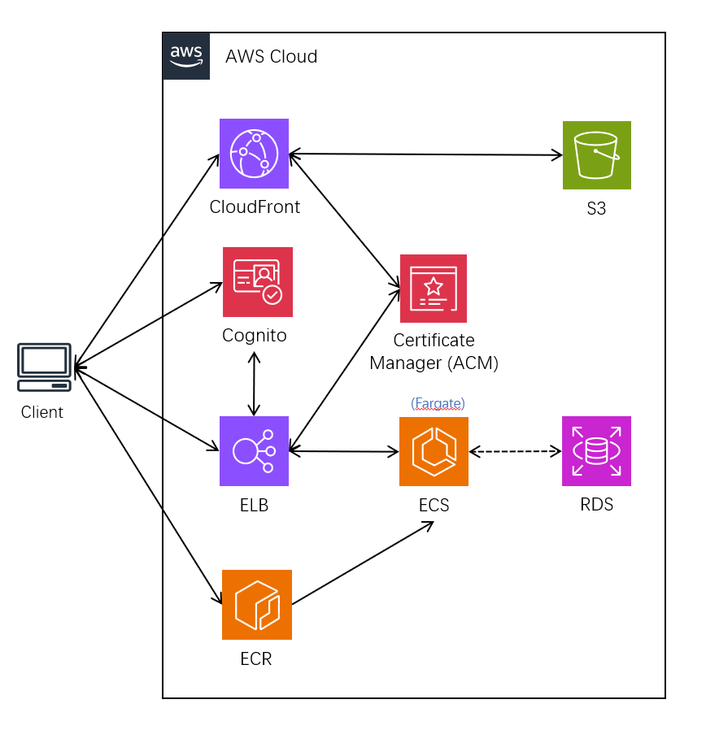

**system architecture diagram**

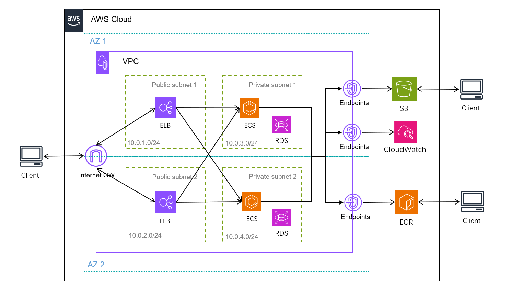

**network architecture diagram**

# 2 Project Overview

## 2.1 Project Structure
```
/cloudformation
├── main.yaml              # Main template that integrates sub-templates
├── parameters.yaml        # Parameter file (optional)
├── frontend               # Frontend service templates
│ ├── s3-cloudfront.yaml   # Includes S3 and CloudFront configuration
├── backend                # Backend service templates
│ ├── ecs.yaml             # ECS services, including App and PostgreSQL containers
│ ├── s3.yaml              # S3 storage configuration
├── security               # Security service templates
│ ├── cognito.yaml         # Cognito User Pool and Identity Pool
├── network                # Networking modules
│ ├── vpc.yaml             # Creates VPC and subnets
│ ├── alb.yaml             # Creates ALB and security groups
│ ├── alb-https.yaml       # Creates ALB listener and integrates with Cognito for authentication
├── registry               # Image management module
│ ├── ecr.yaml             # ECR repositories
├── shared                 # Shared modules
│ ├── iam-roles.yaml       # IAM roles, including permissions for GitHub Actions and ECS tasks
```
## 2.2 Project Secrets
These secrets should be saved in Github project Secrets.

AWS_ACCOUNT_ID:

AWS_CERTIFICATE_ARN:

# 3. Procedure

## 3.1 Prerequisites

- Ensure the AWS CLI is installed in the local environment.

- Use a dedicated AWS account for the GitHub project execution, and store the account ID in the GitHub project secret: AWS_ACCOUNT_ID.

## 3.2 Setup github connection via OIDC

Follow the guides below to establish the OIDC connection between your GitHub project and the AWS platform:

- [Use IAM roles to connect GitHub Actions to actions in AWS](https://aws.amazon.com/blogs/security/use-iam-roles-to-connect-github-actions-to-actions-in-aws/)

- [Configure AWS credentials action for GitHub Actions](https://github.com/marketplace/actions/configure-aws-credentials-action-for-github-actions)

**Note:** For simplicity, the **AdministratorAccess** policy has been assigned to the `github-actions-role`. However, this practice is strictly prohibited in production environments.

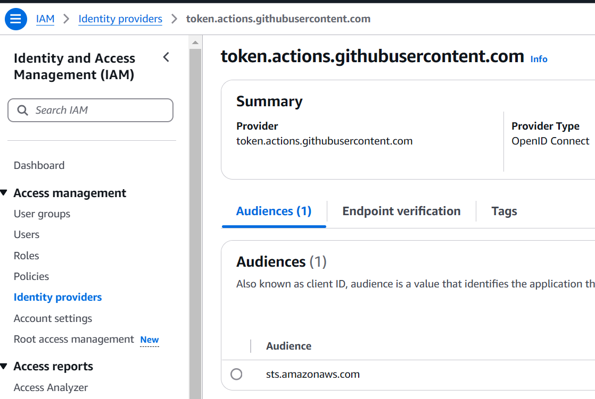
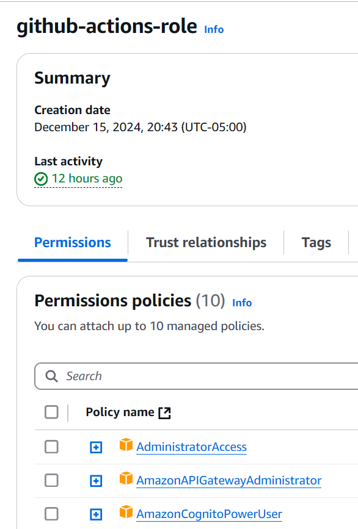
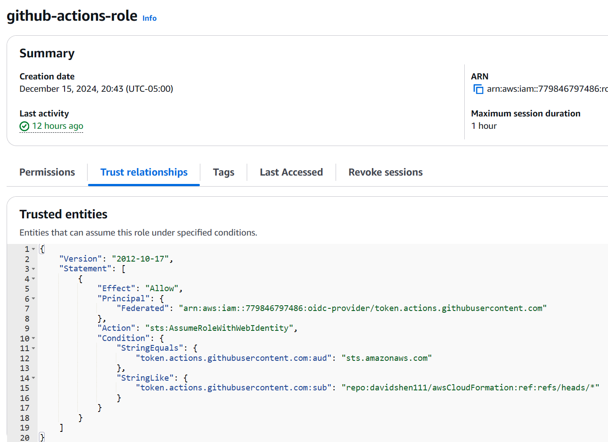
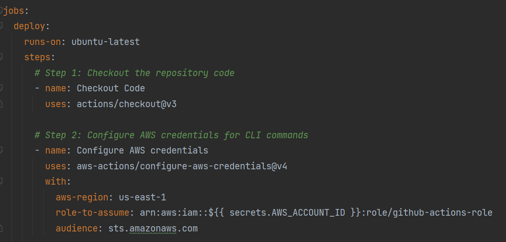

## 3.3 Github CICD pipeline job
```
Execute "registry" job
```
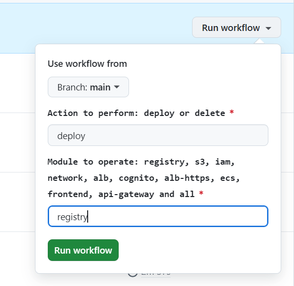

## 3.4. ECS Images Uploading 

Follow the procedure titled "Docker Image Operation" in the appendix.

## 3.5 Github CICD pipeline jobs
```
Execute below jobs:
- s3
- iam
- network
- alb
- cognito
```

## 3.6 Create a user in Cognito using the AWS CLI or the AWS Management Console.

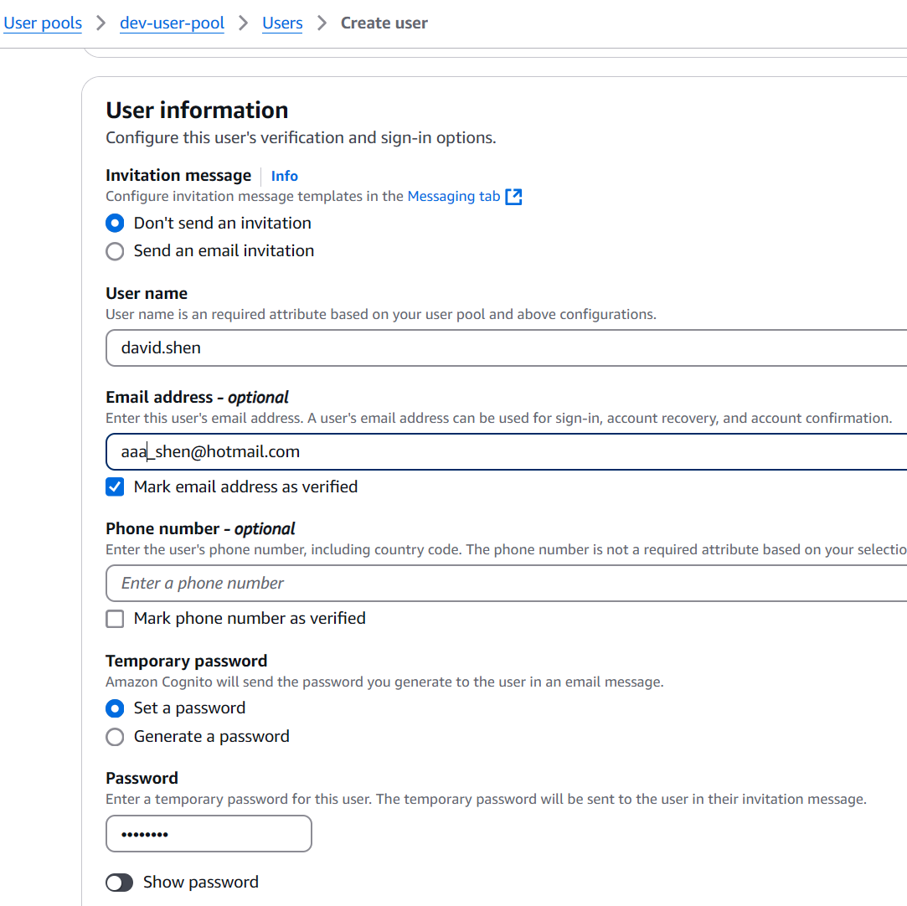
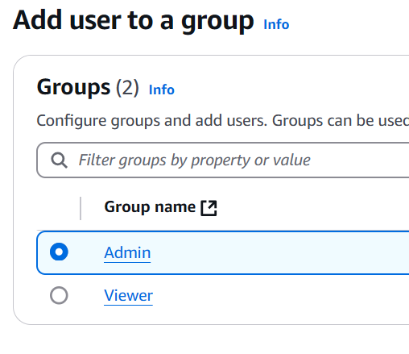

## 3.7 Generate a self-signed certificate and import it into AWS Certificate Manager.
Open a Git Bash terminal and follow the steps below to generate the certificate. Ensure the Common Name (CN) matches your ALB DNS name.
```bash
openssl genrsa -out private-key.pem 2048

openssl req -new -key private-key.pem -out csr.pem -subj '/C=US/ST=New York/L=New York/O=Test\<T=your ALB DNS> >
# or 
# openssl req -new -key private-key.pem -out csr.pem
 
openssl x509 -req -in csr.pem -signkey private-key.pem -out certificate.pem -days 365
```
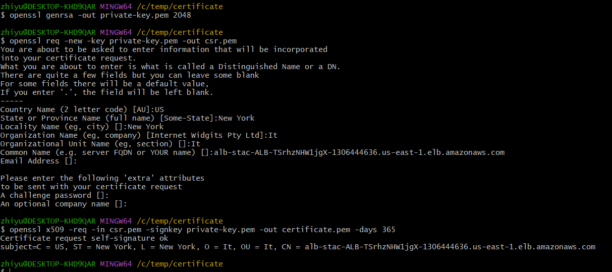

Import it into AWS Certificate Manager by CLI or console

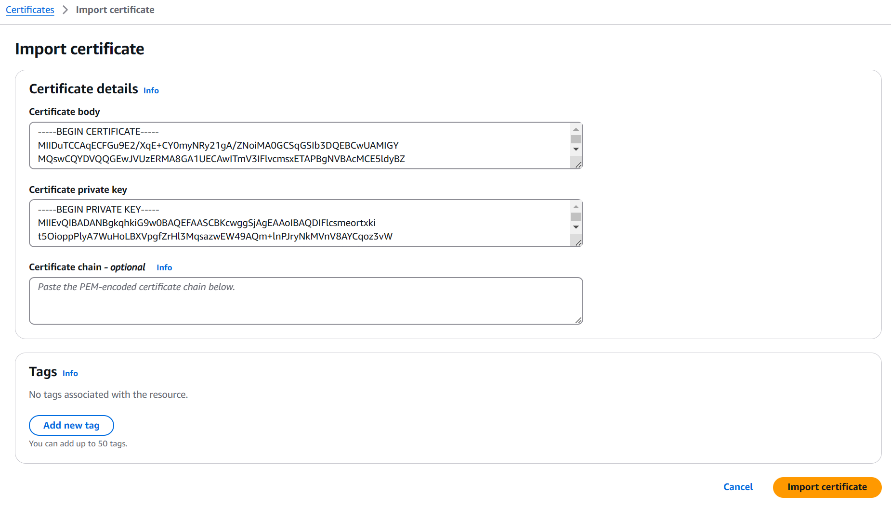

## 3.8 Update the GitHub CI/CD environment secret AWS_CERTIFICATE_ARN with the ARN value of the newly created certificate.
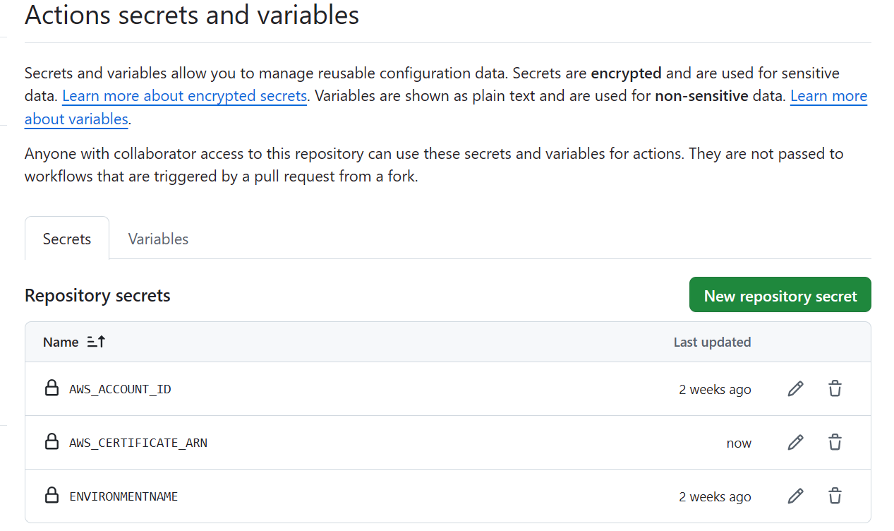

## 3.9 Github CICD pipeline jobs
```
Execute below jobs:
- alb-https
- ecs
- frontend
```
## 3.10 Verify Backend Functionality
Open the link in your browser
```
https://<your ALB DNS>/getData
```

This is the final status in Cloudformation.

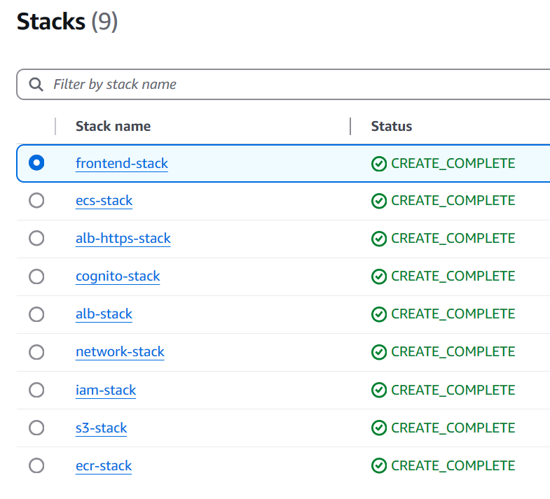

**Note:**
- The main.yml and parameters.yaml files are not utilized in this project and are currently under review for future implementation to support complete system deployment.
- There is no integration between the frontend and backend at this stage.

# Appendix

## 1. Docker image operation

1 Login ECR
```bash
aws ecr get-login-password --region us-east-1 | docker login --username AWS --password-stdin 779846797486.dkr.ecr.us-east-1.amazonaws.com/dev-application-repo
```
2 Build image
```bash
docker build -t my-backend -f dockerfile/Dockerfile .
```
3 Mark image
```bash
docker tag my-backend:latest 779846797486.dkr.ecr.us-east-1.amazonaws.com/dev-application-repo:latest
```
4 Create Repository(ignore this step in this procedure)
```bash
aws ecr create-repository --repository-name dev-application-repo/ --region us-east-1
```
5 Push image to ECR
```bash
docker push 779846797486.dkr.ecr.us-east-1.amazonaws.com/dev-application-repo:latest
```
6 Pull postgres image to local
```bash
docker pull postgres:16.6
```
7 Mark image
```bash
docker tag postgres:16.6 779846797486.dkr.ecr.us-east-1.amazonaws.com/dev-postgres-repo:16.6
```
8 Push image to ECR
```bash
docker push 779846797486.dkr.ecr.us-east-1.amazonaws.com/dev-postgres-repo:16.6
```

The dev-application code is stored in https://github.com/davidshen111/homework  


